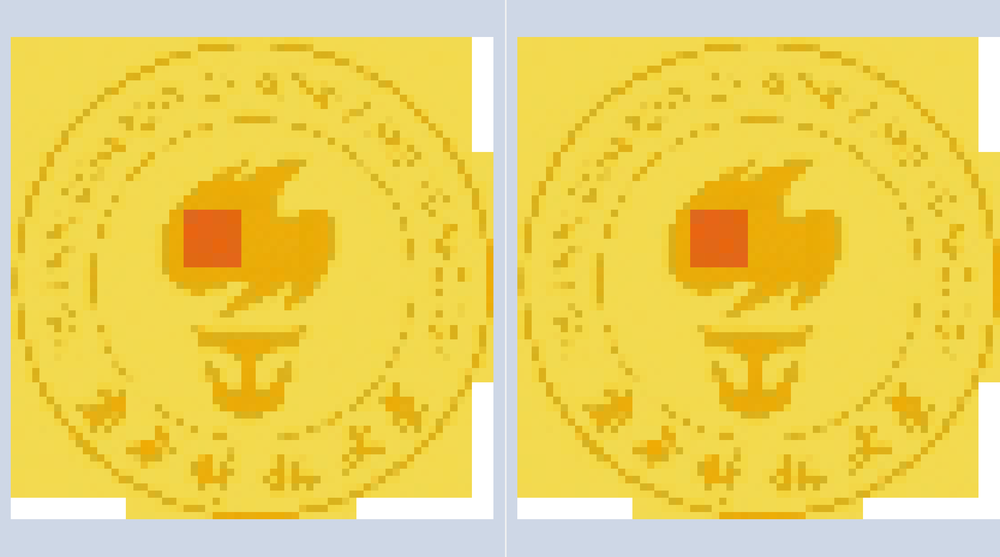

# C++ 期末报告

12113004 谢齐家

## 基础功能

### 1. 最近邻插值实现

最近邻插值（Nearest Neighbor Interpolation）是一种常用的图像插值方法，主要用于图像缩放、旋转或变换。在进行插值时，目标像素的值直接取自输入图像中离该目标最近的像素值。由于这种方法不考虑邻近像素的权重，因此计算较为简单，处理速度快。其主要优点是实现简单，适用于实时处理和低复杂度的应用。

然而，最近邻插值也有明显的缺点，尤其在图像放大时，容易出现马赛克效应和明显的失真，因为插值后的图像缺乏平滑过渡，细节信息丢失较多。由于其计算简单，常常用于对速度要求较高的场合，尤其是当图像精度要求较低时。总体而言，最近邻插值适用于需要较高计算效率但对图像质量要求不高的应用场景。

#### 1.1 代码分析

*伪代码如下：*

#### Algorithm : Nearest - neighbor interpolation

**Input:**  
 $\text{src}$ (input image),  $\text{fx}$ (scaling factor for x), $\text{fy}$(scaling factor for y).

**Output:**  
$\text{dst}$ (resized image).


1. **Get the dimensions and channels of the source image**  
   $\text{src\_rows} = \text{rows}(src); \, \text{src\_cols} = \text{cols}(src); \, \text{src\_channels} = \text{channels}(src);$ 

2. **Calculate the dimensions of the destination image**  
   $\text{dst\_rows} = \text{floor}(\frac{\text{src\_rows}}{\text{fy}}); \, \text{dst\_cols} = \text{floor}(\frac{\text{src\_cols}}{\text{fx}});$

3. **Create the destination image**  
   $\text{dst.create}(\text{dst\_rows}, \text{dst\_cols}, \text{src.type}())$

4. **For each pixel in the destination image, perform the following**  
   **for** \($ i = 0 \text{ to } \text{dst\_rows} - 1 $\)  
   &emsp; **for** \( $j = 0 \text{ to } \text{dst\_cols} - 1$ \)  
   &emsp;&emsp; $\text{src\_i} = \text{floor}(i \times \text{fy});$  
   &emsp;&emsp; $\text{src\_j} = \text{floor}(j \times \text{fx});$  

   &emsp;&emsp; $\text{src\_i} = \text{min}(\text{max}(\text{src\_i}, 0), \text{src\_rows} - 1)$;  
   &emsp;&emsp; $\text{src\_j} = \text{min}(\text{max}(\text{src\_j}, 0), \text{src\_cols} - 1);$

   &emsp;&emsp; **if** \( $\text{src\_channels} = 1$ \)  
   &emsp;&emsp;&emsp; $\text{dst}(i, j) = \text{src}(src\_i, src\_j)$;  
   &emsp;&emsp; **else**  
   &emsp;&emsp;&emsp; **for** \( $c = 0 \text{ to } \text{src\_channels} - 1$ \)  
   &emsp;&emsp;&emsp;&emsp; $\text{dst}(i, j)[c] = \text{src}(src\_i, src\_j)[c]$;  
   &emsp;&emsp; **end for**  
   &emsp;&emsp; **end if**  

   **end for**  
   **end for**  

5. **Return the resized image**  
   $\text{return dst}$;

*源码如下：*


```c++
void resize(const Mat& src, Mat& dst, double fx, double fy) {
    int src_rows = src.rows;
    int src_cols = src.cols;
    int src_channels = src.channels();

    int dst_rows = static_cast<int>(src_rows / fy);
    int dst_cols = static_cast<int>(src_cols / fx);
    
    dst.create(dst_rows, dst_cols, src.type());

    for (int i = 0; i < dst_rows; ++i) {
        for (int j = 0; j < dst_cols; ++j) {
            int src_i = static_cast<int>(i * fy);
            int src_j = static_cast<int>(j * fx);

            src_i = min(max(src_i, 0), src_rows - 1);
            src_j = min(max(src_j, 0), src_cols - 1);

            if (src_channels == 1) {
                dst.at<uchar>(i, j) = src.at<uchar>(src_i, src_j);
            } else {
                for (int c = 0; c < src_channels; ++c) {
                    dst.at<Vec3b>(i, j)[c] = src.at<Vec3b>(src_i, src_j)[c];
                }
            }
        }
    }
}
```

#### 1.2 图片测试结果

>
>
>原图（左），缩小10倍的图片（右)
>由于画图涉及缩放会有失真，具体图片可见源码生成，后不再赘述

### 2. 多通道支持

#### 2.2 代码分析

在源码中单个像素运算时，判断通道数并选择处理方式以实现多通道支持。

```cpp
if (src_channels == 1) {
    dst.at<uchar>(i, j) = src.at<uchar>(src_i, src_j);
} else {
    for (int c = 0; c < src_channels; ++c) {
        dst.at<Vec3b>(i, j)[c] = src.at<Vec3b>(src_i, src_j)[c];
    }
}
```

- **单通道（灰度图像）处理**：如果图像是单通道（即 `src_channels == 1`），代码使用 `dst.at<uchar>(i, j) = src.at<uchar>(src_i, src_j)` 来处理每个像素。这里，`uchar` 代表每个像素的灰度值（通常在 0 到 255 之间）。

- **多通道（彩色图像）处理**：如果图像有多个通道（如 RGB 图像），代码使用以下循环来为每个通道赋值：

  ```c++
  for (int c = 0; c < src_channels; ++c) {
      dst.at<Vec3b>(i, j)[c] = src.at<Vec3b>(src_i, src_j)[c];
  }
  ```

#### 2.2 图片测试结果

>
>
>单通道原图（左），缩小10倍的图片（右)

###  3. 图像放大缩小和不定尺寸的支持

#### 3.1 代码分析

在给定的 `resize` 函数中，图像放大和缩小通过调整 `fx`（水平缩放因子）和 `fy`（垂直缩放因子）实现。目标图像的大小根据源图像的尺寸和缩放因子计算：

```cpp
int dst_rows = static_cast<int>(src_rows / fy);
int dst_cols = static_cast<int>(src_cols / fx);
```

这使得目标图像的尺寸不必是源图像的整数倍，支持不定尺寸的缩放。例如，`fx = 1.5` 和 `fy = 2.0` 将目标图像的宽度放大 1.5 倍，高度放大 2 倍。

对于不保持原有长宽比，`fx` 和 `fy` 可以不同，这允许图像在放大或缩小时拉伸或压缩，改变宽高比。例如，`fx = 2.0` 和 `fy = 1.0` 会导致图像水平放大，而垂直方向不变。

在插值方面，函数使用最近邻插值法来确定目标图像每个像素的值。通过计算目标像素的对应源像素位置 `(src_i, src_j)`，并限制其在源图像范围内，直接复制源像素值：

```cpp
int src_i = static_cast<int>(i * fy);
int src_j = static_cast<int>(j * fx);
```

这种方法确保了图像能根据指定的比例进行缩放，同时支持不同缩放比例（非整数倍）和不保持原始长宽比的情况。

#### 3.2 图片测试结果

>
>
>原图（左），放大4倍的图片（右)

>
>
>原图（左），缩放比例不一致的图片（右)

### 4. 切片和多线程加速

#### 4.1 代码分析

OpenCV 的 `parallel_for_` 方法是一个用于并行处理任务的高效工具，能够加速计算密集型操作。它基于 OpenMP 和线程池机制，通过将任务分解为多个子任务并分配到多个线程上，从而在多核处理器上实现并行计算。在图像处理和计算机视觉任务中，`parallel_for_` 常用于处理大规模数据，例如图像的每一行或每一列。

在 `resize_parallel` 函数中，`parallel_for_` 被用来并行化图像缩放操作。具体来说，目标图像的每一行（`Range(0, dst_rows)`）被分配给一个线程进行处理。这样，每个线程负责处理目标图像中的不同部分，从而加速整体计算过程。通过这种方式，函数能够充分利用多核 CPU 来加速图像的缩放过程，特别适合处理高分辨率图像。

*源代码如下：*

```c++
void resize_parallel(const Mat& src, Mat& dst, double fx, double fy) {
    int src_rows = src.rows;
    int src_cols = src.cols;
    int src_channels = src.channels();

    int dst_rows = round(src_rows / fy);
    int dst_cols = round(src_cols / fx);
    
    dst.create(dst_rows, dst_cols, src.type());

    cv::parallel_for_(cv::Range(0, dst_rows), [&](const cv::Range& r) {
        for (int i = r.start; i < r.end; ++i) {
            for (int j = 0; j < dst_cols; ++j) {
                int src_i = static_cast<int>(i * fy);
                int src_j = static_cast<int>(j * fx);
                src_i = std::clamp(src_i, 0, src_rows - 1);
                src_j = std::clamp(src_j, 0, src_cols - 1);
                
                if (src_channels == 1) {
                    dst.at<uchar>(i, j) = src.at<uchar>(src_i, src_j);
                } else {
                    dst.at<Vec3b>(i, j) = src.at<Vec3b>(src_i, src_j);
                }
            }
        }
    });
}
```

#### 4.2 性能测试：

测试平台：

- 11th Gen Intel(R) Core(TM) i5-11300H @ 3.10GHz
- WSL：Ubuntu 22.04 LST
- g++ (Ubuntu 11.4.0-1ubuntu1~22.04) 11.4.0
- OpenCV version: 4.10.0-dev
- 编译器优化：-o0

测试样例：

- 大小为1349\*1349图片缩小20倍
- 并行和非并行分别运行1000000次计算耗时

测试代码：

```c++
double fx = 20;
double fy = 20;

// normal one
int new_times = test_times/1;
auto start = std::chrono::high_resolution_clock::now();
for (std::size_t i = 0; i < new_times; i++){
    Mat dst;
    resize(image,dst,fx,fy);
}
auto end = std::chrono::high_resolution_clock::now();
std::chrono::duration<double> elapsed = end - start;
std::chrono::duration<double> time_pre_test = elapsed/(new_times);
std::cout << "normal resize\t" 
            << new_times << "\tElapsed time: " << elapsed.count() << " seconds\t" 
            << "average excuation time pre test: " << time_pre_test.count() << std::endl;

// parallel one
start = std::chrono::high_resolution_clock::now();
for (std::size_t i = 0; i < test_times; i++){
    Mat dst;
    resize_parallel(image,dst,fx,fy);
}
end = std::chrono::high_resolution_clock::now();
elapsed = end - start;
std::chrono::duration<double> time_pre_test_2 = elapsed/(test_times);
std::cout << "parallel resize\t" 
            << test_times << "\tElapsed time: " << elapsed.count() << " seconds\t" 
            << "average excuation time pre test: " << time_pre_test_2.count() << std::endl;

// compare
std::cout << "speed up: " << time_pre_test.count()/time_pre_test_2.count() << " times" << std::endl;
```

测试结果：

```log
normal resize   1000000 Elapsed time: 139.25 seconds    average excuation time pre test: 0.00013925
parallel resize 1000000 Elapsed time: 24.3219 seconds   average excuation time pre test: 2.43219e-05
speed up: 5.72527 times
```

通过并行大约提升5.7倍。

### 5. 对比分析

#### 5.1 准确度对比：

测试平台：

- 与上述一致

测试样例：

- 三张大小分别为1920\*1080，4971\*3663，1349\*1349的图片及其灰度图片
- 三张图片分别进行三次不同的放缩测试
- 比较OpenCV和并行加速后的手写resize之间的区别

测试代码：

main

```c++
// save image 1
Opencv_resize_test_case("../image/src/SUSTech.jpg", 
                        "../image/P5_00_OpenCV_SUSTech.jpg", 
                        "../image/P5_00_parallel_SUSTech.jpg", 20, 20);
Opencv_resize_test_case("../image/src/SUSTech.jpg", 
                        "../image/P5_01_OpenCV_SUSTech.jpg", 
                        "../image/P5_01_parallel_SUSTech.jpg", 0.5, 0.5);
Opencv_resize_test_case("../image/src/SUSTech_one_channel.jpg",
                        "../image/P5_02_OpenCV_SUSTech.jpg",
                        "../image/P5_02_parallel_SUSTech.jpg", 10, 10);

// save image 2
Opencv_resize_test_case("../image/src/calendar.jpg",
                        "../image/P5_10_OpenCV_calendar.jpg",
                        "../image/P5_10_parallel_calendar.jpg", 10.8, 10.8);
Opencv_resize_test_case("../image/src/calendar.jpg",
                        "../image/P5_11_OpenCV_calendar.jpg",
                        "../image/P5_11_parallel_calendar.jpg", 0.46, 0.46);
Opencv_resize_test_case("../image/src/calendar_one_channel.jpg",
                        "../image/P5_12_OpenCV_calendar.jpg",
                        "../image/P5_12_parallel_calendar.jpg", 32.6, 57.8);

// save image 3
Opencv_resize_test_case("../image/src/test_image.jpg",
                        "../image/P5_20_OpenCV_test_image.jpg",
                        "../image/P5_20_parallel_test_image.jpg", 3.2, 5.9);
Opencv_resize_test_case("../image/src/test_image.jpg",
                        "../image/P5_21_OpenCV_test_image.jpg",
                        "../image/P5_21_parallel_test_image.jpg", 4.4, 7.6);
Opencv_resize_test_case("../image/src/test_image_one_channel.jpg",
                        "../image/P5_22_OpenCV_test_image.jpg",
                        "../image/P5_22_parallel_test_image.jpg", 222, 333);
```

funtion

```C++
void Opencv_resize_test_case(string img_path, string save_opencv_path, string save_resize_path, 
                             double fx, double fy){
    Mat image = cv::imread(img_path);
    Mat dst1;
    cv::resize(image,dst1,cv::Size(),1/fx,1/fy,0);
    cv::imwrite(save_opencv_path, dst1);
    Mat dst2;
    resize_parallel(image,dst2,fx,fy);
    cv::imwrite(save_resize_path, dst2);

    if (dst1.size() != dst2.size()) {
        cerr << "ERROR: The sizes of the two images do not match." << endl;
        cerr << "dst1 size: " << dst1.size() << endl;
        cerr << "dst2 size: " << dst2.size() << endl;
        return;
    }

    if (dst1.type() != dst2.type()) {
        cerr << "ERROR: The types of the two images do not match." << endl;
        return;
    }

    cv::Mat diff;
    cv::compare(dst1, dst2, diff, cv::CMP_NE);

    cv::Mat diff_gray;
    cv::cvtColor(diff, diff_gray, cv::COLOR_BGR2GRAY);

    int numDiffPixels = cv::countNonZero(diff_gray);

    if (numDiffPixels == 0)
    {
        cout << "MATCH: two images are same" << endl;
    } else {
        cout << "ERROR: two images are different" << endl;
    }
}
```

测试结果：

```log
MATCH: two images are same
MATCH: two images are same
MATCH: two images are same
MATCH: two images are same
MATCH: two images are same
MATCH: two images are same
MATCH: two images are same
MATCH: two images are same
MATCH: two images are same
```

手写的resize和cv::resize采用线性插值的版本完全一致。

#### 5.2 性能提升对比：

测试平台：

- 与上述一致

测试样例：

- 大小为1349\*1349图片缩小20倍
- opencv和并行resize分别运行1000000次计算耗时

测试结果：

```
OenCV           1000000 Elapsed time: 6.50776 seconds   average excuation time pre test: 6.50776e-06
parallel resize 1000000 Elapsed time: 24.4799 seconds   average excuation time pre test: 2.44799e-05
OpenCV is speed up: 3.76165 times
```

OpenCV 比我们并行的版本速度快3.7倍。

#### 5.3 OpenCV深度优化概览

cv::size的运行速度快的原因是多方面的，在以下几个方面都进行了更为深度的优化。

- **内部优化：** `cv::resize` 是 OpenCV 库中的高度优化函数，它使用了针对不同图像尺寸和插值方法的专门优化。这些优化包括更高效的内存访问模式、数据缓存优化等。此外，OpenCV 的代码会根据硬件平台和图像特性动态选择最合适的算法。

- **插值算法：** `cv::resize` 内部采用了如双线性插值等更高效的插值算法，通常比最近邻插值（你的实现）要快且效果更好。虽然最近邻插值计算上更简单，但由于其低效的内存访问和处理方式，可能在某些图像大小和硬件条件下并不会表现出预期的性能提升。

- **内存访问：** OpenCV 对内存访问进行了高度优化。`cv::resize` 通常会预分配并优化数据缓存，而你在 `resize_parallel` 中使用了 `at()` 方法，这不仅带来了额外的边界检查，还可能导致内存访问不如 OpenCV 内部优化的方式高效。

- **并行化策略：** `cv::resize` 在内部也进行了并行化处理，但其粒度和线程管理非常高效，能够确保不会因为线程调度开销而导致性能下降。而你在 `resize_parallel` 中使用了 `cv::parallel_for_`，虽然并行化了行的处理，但对于某些图像或硬件平台，这样的粒度可能导致线程调度开销超出计算本身的收益，进而降低了整体性能。

- **硬件加速：** OpenCV 的实现可能利用了硬件加速，如 SIMD 指令集或 GPU 加速，而你的实现没有针对这一点进行优化，导致效率较低。


## Bonus

### 1. 双线性插值实现

#### 1.1 代码分析

*伪代码如下：*

#### Algorithm : Nearest - neighbor interpolation

**Input:**  
$\text{src}$ (input image),  $\text{fx}$ (scaling factor for x), $\text{fy}$(scaling factor for y).

**Output:**  
$\text{dst}$ (resized image).

1. **Get the dimensions and channels of the source image**  
   $\text{src\_rows} = \text{rows}(src); \, \text{src\_cols} = \text{cols}(src); \, \text{src\_channels} = \text{channels}(src);$ 

2. **Calculate the dimensions of the destination image**  
   $\text{dst\_rows} = \text{floor}(\frac{\text{src\_rows}}{\text{fy}}); \, \text{dst\_cols} = \text{floor}(\frac{\text{src\_cols}}{\text{fx}});$

3. **Create the destination image**  
   $\text{dst.create}(\text{dst\_rows}, \text{dst\_cols}, \text{src.type}())$

4. **For each pixel in the destination image, perform the following**  
   **for** \($ i = 0 \text{ to } \text{dst\_rows} - 1 $\)  
   &emsp; **for** \( $j = 0 \text{ to } \text{dst\_cols} - 1$ \)  
   &emsp;&emsp; $\text{src\_i} = (i+0.5) \times \text{fy} - 0.5;$  
   &emsp;&emsp; $\text{src\_j} = (j+0.5) \times \text{fx} - 0.5;$  

   &emsp;&emsp; $\text{src\_i} = \text{min}(\text{max}(\text{src\_i}, 0), \text{src\_rows} - 1)$;  
   &emsp;&emsp; $\text{src\_j} = \text{min}(\text{max}(\text{src\_j}, 0), \text{src\_cols} - 1);$

   &emsp;&emsp; **Calculate the four nearest neighbor points for bilinear interpolation**  
   &emsp;&emsp; $x1 = \text{floor}(\text{src\_i}); \, y1 = \text{floor}(\text{src\_j});$  
   &emsp;&emsp; $x2 = x1 + 1; \, y2 = y1 + 1;$  

   &emsp;&emsp; **Boundary check**  
   &emsp;&emsp; $x1 = \text{min}(\text{max}(x1, 0), \text{src\_rows} - 1);$  
   &emsp;&emsp; $y1 = \text{min}(\text{max}(y1, 0), \text{src\_cols} - 1);$  
   &emsp;&emsp; $x2 = \text{min}(\text{max}(x2, 0), \text{src\_rows} - 1);$  
   &emsp;&emsp; $y2 = \text{min}(\text{max}(y2, 0), \text{src\_cols} - 1);$  

   &emsp;&emsp; **Calculate bilinear interpolation weights**  
   &emsp;&emsp; $w\_x2 = \text{src\_i} - x1;$  
   &emsp;&emsp; $w\_x1 = 1 - w\_x2;$  
   &emsp;&emsp; $w\_y2 = \text{src\_j} - y1;$  
   &emsp;&emsp; $w\_y1 = 1 - w\_y2;$  

   &emsp;&emsp; **if** $\text{src\_channels} = 1$ (Single-channel image)  
   &emsp;&emsp;&emsp; $I\_y1 = w\_x1 \times \text{src}(x1, y1) + w\_x2 \times \text{src}(x2, y1);$  
   &emsp;&emsp;&emsp; $I\_y2 = w\_x1 \times \text{src}(x1, y2) + w\_x2 \times \text{src}(x2, y2);$  
   &emsp;&emsp;&emsp; $\text{dst}(i, j) = w\_y1 \times I\_y1 + w\_y2 \times I\_y2;$  

   &emsp;&emsp; **else** (Multi-channel image)  
   &emsp;&emsp;&emsp; **for** \( c = 0 \text{ to } \text{src\_channels} - 1 \)  
   &emsp;&emsp;&emsp;&emsp; $I\_y1 = w\_x1 \times \text{src}(x1, y1)[c] + w\_x2 \times \text{src}(x2, y1)[c];$  
   &emsp;&emsp;&emsp;&emsp; $I\_y2 = w\_x1 \times \text{src}(x1, y2)[c] + w\_x2 \times \text{src}(x2, y2)[c];$  
   &emsp;&emsp;&emsp;&emsp; $\text{dst}(i, j)[c] = w\_y1 \times I\_y1 + w\_y2 \times I\_y2;$  
   &emsp;&emsp;&emsp; **end for**  
   &emsp;&emsp; **end if**  

   **end for**  
   **end for**  

5. **Return the resized image**  
   $\text{return dst}$;
   

*源代码：*

```c++
void resize_bilinear(const Mat& src, Mat& dst, double fx, double fy) {
    int src_rows = src.rows;
    int src_cols = src.cols;
    int src_channels = src.channels();

    int dst_rows = static_cast<int>(src_rows / fy);
    int dst_cols = static_cast<int>(src_cols / fx);
    
    dst.create(dst_rows, dst_cols, src.type());

    for (int i = 0; i < dst_rows; ++i) {
        for (int j = 0; j < dst_cols; ++j) {
            double src_i = (i+0.5)*fx-0.5;
            double src_j = (j+0.5)*fy-0.5;

            int x1 = static_cast<int>(src_i);
            int y1 = static_cast<int>(src_j);
            int x2 = x1+1;
            int y2 = y1+1;

            x1 = min(max(x1, 0), src_rows - 1);
            y1 = min(max(y1, 0), src_cols - 1);
            x2 = min(max(x2, 0), src_rows - 1);
            y2 = min(max(y2, 0), src_cols - 1); 
            
            double w_x2 = src_i - x1;
            double w_x1 = 1-w_x2;
            double w_y2 = src_j - y1;
            double w_y1 = 1-w_y2;
            
            if (src_channels == 1) {
                double I_y1 = w_x1*src.at<uchar>(x1, y1) + w_x2*src.at<uchar>(x2, y1);
                double I_y2 = w_x1*src.at<uchar>(x1, y2) + w_x2*src.at<uchar>(x2, y2);
                dst.at<uchar>(i, j) = static_cast<uchar>(w_y1*I_y1 + w_y2*I_y2);
            } else {
                for (int c = 0; c < src_channels; ++c) {
                    double I_y1 = w_x1*src.at<Vec3b>(x1, y1)[c] + w_x2*src.at<Vec3b>(x2, y1)[c];
                    double I_y2 = w_x1*src.at<Vec3b>(x1, y2)[c] + w_x2*src.at<Vec3b>(x2, y2)[c];
                    dst.at<Vec3b>(i, j)[c] = static_cast<uchar>(w_y1*I_y1 + w_y2*I_y2);
                }
            }
        }
    }
}

```

#### 1.2 计算精度分析

用 WinMerge 对手写双线性插值和cv::size的双线性插值版本的运行结果进行对比可以发现：虽然目测效果整体差不多，但是具体到像素都稍有区别。

> 
> 
> OpenCV的结果（左），手写的结果（右）

#### 1.3 耗时对比分析

测试平台：

- 与上述一致

测试样例：

- 大小为1349\*1349图片缩小20倍
- opencv和并行的双线性插值版本的resize分别运行1000000次计算耗时

测试结果：

```log
OenCV           1000000 Elapsed time: 12.7391 seconds   average excuation time pre test: 1.27391e-05
parallel resize 1000000 Elapsed time: 113.116 seconds   average excuation time pre test: 0.000113116
OpenCV is speed up: 8.87947 times
```

### 2. 支持多种数据类型


### 3. 综合优化

#### 3.1 编译器优化

将编译器的优化等级从-o0提高到-o3可以大幅提高手写代码的运行速度。

更改编译器优化等级是最快的提高代码运行速度的方式

将优化等级设置为-o3后：

```log
串并行 resize 对比：
normal resize   1000000 Elapsed time: 42.4712 seconds   average excuation time pre test: 4.24712e-05
parallel resize 1000000 Elapsed time: 10.1495 seconds   average excuation time pre test: 1.01495e-05
speed up: 4.18455 times

OpenCV 和并行 resize 对比：
OenCV           1000000 Elapsed time: 7.0372 seconds    average excuation time pre test: 7.0372e-06
parallel resize 1000000 Elapsed time: 9.67815 seconds   average excuation time pre test: 9.67815e-06
OpenCV is speed up: 1.37528 times
P5 is down

双线性 OpenCV 和并行双线性 resize对比：
OenCV           1000000 Elapsed time: 16.5617 seconds   average excuation time pre test: 1.65617e-05
parallel resize 1000000 Elapsed time: 21.3614 seconds   average excuation time pre test: 2.13614e-05
OpenCV is speed up: 1.28981 times
```

| 运行时间对比                  | -o0         | -o3         |
| ----------------------------- | ----------- | ----------- |
| 最近邻插值串行                | 139.25      | 42.4712     |
| 最近邻插值并行                | 24.3219     | 10.1495     |
| 最近邻插值串行/最近邻插值并行 | **5.72527** | **4.18455** |
| 最近邻插值并行                | 24.4799     | 9.67815     |
| 最近邻OpenCV                  | 6.50776     | 7.0372      |
| 最近邻插值并行/最近邻OpenCV   | **3.76165** | **1.37528** |
| 双线性插值并行                | 113.116     | 21.3614     |
| 双线性OpenCV                  | 12.7391     | 16.5617     |
| 双线性插值并行/双线性OpenCV   | **8.87947** | **1.28981** |

经过对比可以发现，优化等级对OpenCV的处理时间没有什么大幅改变，但对手写代码的执行时间有着极大缩减。通过将优化等级陶杰到最大，可以在几乎没有进行任何复杂优化的情况下做到堪比最佳执行效率代码的效果。

开启 `-O3` 优化级别后，编译器会进行一系列性能优化，包括循环展开、循环合并、向量化、内联扩展等，以减少代码的执行时间。它会自动识别并优化循环结构，减少冗余的计算，改进内存访问，优化函数调用。此外，常量传播、死代码消除等也会被启用，去除无用代码。编译器还会针对硬件特性进行优化，如利用 SIMD 指令集提升并行计算能力。整体上，`-O3` 优化通过各种技术手段提升程序的执行效率，尤其对计算密集型任务有显著效果。

