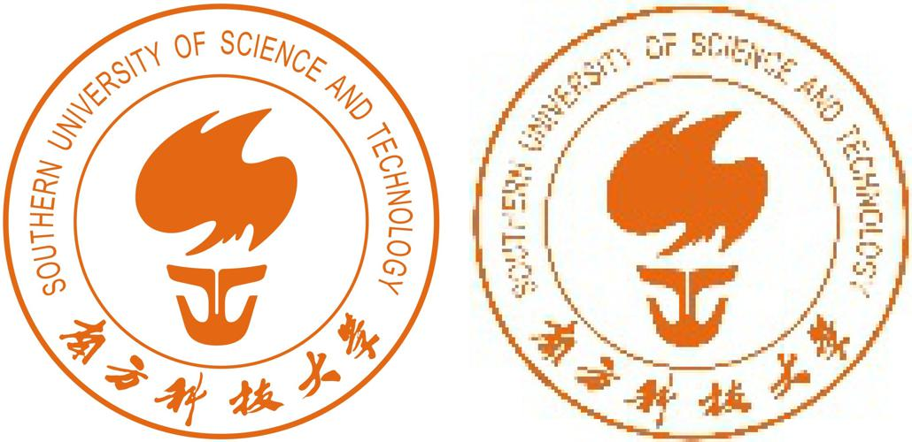
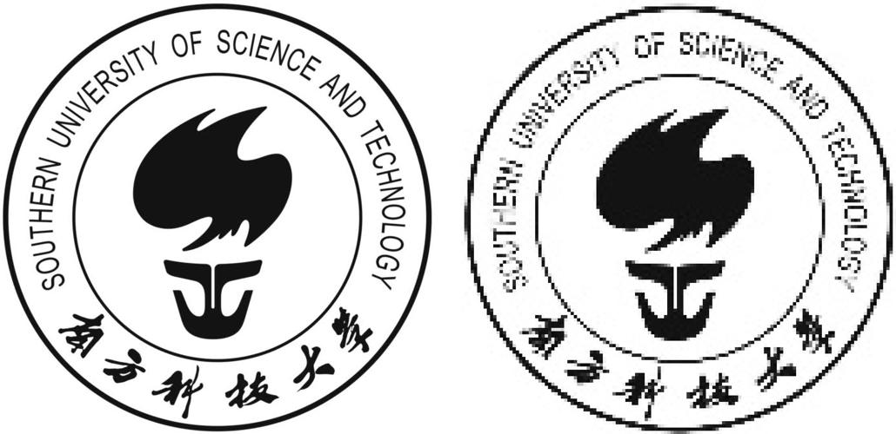

# 计算机高级程序设计期末实验报告


**12113004 谢齐家**
**12111415 陈正非**

**选题 ：基于OpenCV的Resize函数实现与优化**

# Open-CV 算法优化


## 项目需求与完成情况

### 基础需求

| 需求描述                                   | 状态   | 分值 |
|--------------------------------------------|--------|------|
| 使用最近邻插值法实现图像缩放               | 已完成 | 20   |
| 支持多通道图像                             | 已完成 | 15   |
| 支持图像放大、缩小以及任意尺寸调整         | 已完成 | 15   |
| 使用切片和多线程加速                       | 已完成 | 20   |
| 与 OpenCV 内置算法进行对比分析             | 已完成 | 10   |

### 附加需求

| 需求描述                                   | 状态   | 分值 |
|--------------------------------------------|--------|------|
| 实现双线性插值算法                         | 已完成 | 15   |
| 支持多种数据类型（如 U16、F32）            | 已完成 | 10   |
| 使用 SIMD 指令集进行加速                   | 已完成 | 20   |
| 使用 OpenCV 通用向量指令集                 | 未完成 | 10   |
| 探索其他潜在的优化策略                     | 完成编译器优化 | 15   |

### 队员工作及贡献比

|队员| 任务| 贡献比|
|----|----|----|
|谢齐家| 最邻近插值法实现，多通道，多线程，双线性插值|50%|
|陈正非|多种数据类型支持，SIMD加速| 50%|

## 工作概述

  对于基础要求，我们实现了**使用最近邻插值法实现图像缩放**，同时支持**任意比例的多通道图像放大和缩小**；并于opencv内置函数运行结果相比对，结果相同。同时，我们提供了切片和多线程加速的函数接口。在启动编译优化后，我们的运行速度可以优化到opencv的1.4倍。对于算法慢于opencv的原因，我们会在接下来的部分详细给出。\par

  对于附加要求，我们实现了**双线性插值算法**，与opencv内置函数的运行结果一致，同时我们支持了**U16,F32（1通道和3通道）**两种数据类型；基于我们的电脑芯片型号**选取了AUX2指令集**对双线性插值算法和最近邻插值算法进行加速，在没有开启编译优化和OpenMP优化的情况下实现了最高大约**3.5倍的加速比**，并支持多种数据类型。(SIMD的双线性插值算法仅支持U8C3)


## 基础功能

### 1. 最近邻插值实现

最近邻插值（Nearest Neighbor Interpolation）是一种常用的图像插值方法，主要用于图像缩放、旋转或变换。在进行插值时，目标像素的值直接取自输入图像中离该目标最近的像素值。由于这种方法不考虑邻近像素的权重，因此计算较为简单，处理速度快。其主要优点是实现简单，适用于实时处理和低复杂度的应用。

然而，最近邻插值也有明显的缺点，尤其在图像放大时，容易出现马赛克效应和明显的失真，因为插值后的图像缺乏平滑过渡，细节信息丢失较多。由于其计算简单，常常用于对速度要求较高的场合，尤其是当图像精度要求较低时。总体而言，最近邻插值适用于需要较高计算效率但对图像质量要求不高的应用场景。

#### 1.1 代码分析

*伪代码如下：*

#### Algorithm : Nearest - neighbor interpolation

**Input:**
 $\text{src}$ (input image),  $\text{fx}$ (scaling factor for x), $\text{fy}$(scaling factor for y).

**Output:**
$\text{dst}$ (resized image).


1. **Get the dimensions and channels of the source image**
   $\text{src\_rows} = \text{rows}(src); \, \text{src\_cols} = \text{cols}(src); \, \text{src\_channels} = \text{channels}(src);$

2. **Calculate the dimensions of the destination image**
   $\text{dst\_rows} = \text{floor}(\frac{\text{src\_rows}}{\text{fy}}); \, \text{dst\_cols} = \text{floor}(\frac{\text{src\_cols}}{\text{fx}});$

3. **Create the destination image**
   $\text{dst.create}(\text{dst\_rows}, \text{dst\_cols}, \text{src.type}())$

4. **For each pixel in the destination image, perform the following**
   **for** \($ i = 0 \text{ to } \text{dst\_rows} - 1 $\)
   &emsp; **for** \( $j = 0 \text{ to } \text{dst\_cols} - 1$ \)
   &emsp;&emsp; $\text{src\_i} = \text{floor}(i \times \text{fy});$
   &emsp;&emsp; $\text{src\_j} = \text{floor}(j \times \text{fx});$

   &emsp;&emsp; $\text{src\_i} = \text{min}(\text{max}(\text{src\_i}, 0), \text{src\_rows} - 1)$;
   &emsp;&emsp; $\text{src\_j} = \text{min}(\text{max}(\text{src\_j}, 0), \text{src\_cols} - 1);$

   &emsp;&emsp; **if** \( $\text{src\_channels} = 1$ \)
   &emsp;&emsp;&emsp; $\text{dst}(i, j) = \text{src}(src\_i, src\_j)$;
   &emsp;&emsp; **else**
   &emsp;&emsp;&emsp; **for** \( $c = 0 \text{ to } \text{src\_channels} - 1$ \)
   &emsp;&emsp;&emsp;&emsp; $\text{dst}(i, j)[c] = \text{src}(src\_i, src\_j)[c]$;
   &emsp;&emsp; **end for**
   &emsp;&emsp; **end if**

   **end for**
   **end for**

5. **Return the resized image**
   $\text{return dst}$;

*源码如下：*


```c++
void resize(const Mat& src, Mat& dst, double fx, double fy) {
    int src_rows = src.rows;
    int src_cols = src.cols;
    int src_channels = src.channels();

    int dst_rows = static_cast<int>(src_rows / fy);
    int dst_cols = static_cast<int>(src_cols / fx);

    dst.create(dst_rows, dst_cols, src.type());

    for (int i = 0; i < dst_rows; ++i) {
        for (int j = 0; j < dst_cols; ++j) {
            int src_i = static_cast<int>(i * fy);
            int src_j = static_cast<int>(j * fx);

            src_i = min(max(src_i, 0), src_rows - 1);
            src_j = min(max(src_j, 0), src_cols - 1);

            if (src_channels == 1) {
                dst.at<uchar>(i, j) = src.at<uchar>(src_i, src_j);
            } else {
                for (int c = 0; c < src_channels; ++c) {
                    dst.at<Vec3b>(i, j)[c] = src.at<Vec3b>(src_i, src_j)[c];
                }
            }
        }
    }
}
```

#### 1.2 图片测试结果

>
>
>原图（左），缩小10倍的图片（右)
>由于画图涉及缩放会有失真，具体图片可见源码生成，后不再赘述

### 2. 多通道支持

#### 2.2 代码分析

在源码中单个像素运算时，判断通道数并选择处理方式以实现多通道支持。

```cpp
if (src_channels == 1) {
    dst.at<uchar>(i, j) = src.at<uchar>(src_i, src_j);
} else {
    for (int c = 0; c < src_channels; ++c) {
        dst.at<Vec3b>(i, j)[c] = src.at<Vec3b>(src_i, src_j)[c];
    }
}
```

- **单通道（灰度图像）处理**：如果图像是单通道（即 `src_channels == 1`），代码使用 `dst.at<uchar>(i, j) = src.at<uchar>(src_i, src_j)` 来处理每个像素。这里，`uchar` 代表每个像素的灰度值（通常在 0 到 255 之间）。

- **多通道（彩色图像）处理**：如果图像有多个通道（如 RGB 图像），代码使用以下循环来为每个通道赋值：

  ```c++
  for (int c = 0; c < src_channels; ++c) {
      dst.at<Vec3b>(i, j)[c] = src.at<Vec3b>(src_i, src_j)[c];
  }
  ```

#### 2.2 图片测试结果

>
>
>单通道原图（左），缩小10倍的图片（右)

###  3. 图像放大缩小和不定尺寸的支持

#### 3.1 代码分析

在给定的 `resize` 函数中，图像放大和缩小通过调整 `fx`（水平缩放因子）和 `fy`（垂直缩放因子）实现。目标图像的大小根据源图像的尺寸和缩放因子计算：

```cpp
int dst_rows = static_cast<int>(src_rows / fy);
int dst_cols = static_cast<int>(src_cols / fx);
```

这使得目标图像的尺寸不必是源图像的整数倍，支持不定尺寸的缩放。例如，`fx = 1.5` 和 `fy = 2.0` 将目标图像的宽度放大 1.5 倍，高度放大 2 倍。

对于不保持原有长宽比，`fx` 和 `fy` 可以不同，这允许图像在放大或缩小时拉伸或压缩，改变宽高比。例如，`fx = 2.0` 和 `fy = 1.0` 会导致图像水平放大，而垂直方向不变。

在插值方面，函数使用最近邻插值法来确定目标图像每个像素的值。通过计算目标像素的对应源像素位置 `(src_i, src_j)`，并限制其在源图像范围内，直接复制源像素值：

```cpp
int src_i = static_cast<int>(i * fy);
int src_j = static_cast<int>(j * fx);
```

这种方法确保了图像能根据指定的比例进行缩放，同时支持不同缩放比例（非整数倍）和不保持原始长宽比的情况。

#### 3.2 图片测试结果

>
>
>原图（左），放大4倍的图片（右)

>
>
>原图（左），缩放比例不一致的图片（右)

### 4. 切片和多线程加速

#### 4.1 代码分析

OpenCV 的 `parallel_for_` 方法是一个用于并行处理任务的高效工具，能够加速计算密集型操作。它基于 OpenMP 和线程池机制，通过将任务分解为多个子任务并分配到多个线程上，从而在多核处理器上实现并行计算。在图像处理和计算机视觉任务中，`parallel_for_` 常用于处理大规模数据，例如图像的每一行或每一列。

在 `resize_parallel` 函数中，`parallel_for_` 被用来并行化图像缩放操作。具体来说，目标图像的每一行（`Range(0, dst_rows)`）被分配给一个线程进行处理。这样，每个线程负责处理目标图像中的不同部分，从而加速整体计算过程。通过这种方式，函数能够充分利用多核 CPU 来加速图像的缩放过程，特别适合处理高分辨率图像。

*源代码如下：*

```c++
void resize_parallel(const Mat& src, Mat& dst, double fx, double fy) {
    int src_rows = src.rows;
    int src_cols = src.cols;
    int src_channels = src.channels();

    int dst_rows = round(src_rows / fy);
    int dst_cols = round(src_cols / fx);

    dst.create(dst_rows, dst_cols, src.type());

    cv::parallel_for_(cv::Range(0, dst_rows), [&](const cv::Range& r) {
        for (int i = r.start; i < r.end; ++i) {
            for (int j = 0; j < dst_cols; ++j) {
                int src_i = static_cast<int>(i * fy);
                int src_j = static_cast<int>(j * fx);
                src_i = std::clamp(src_i, 0, src_rows - 1);
                src_j = std::clamp(src_j, 0, src_cols - 1);

                if (src_channels == 1) {
                    dst.at<uchar>(i, j) = src.at<uchar>(src_i, src_j);
                } else {
                    dst.at<Vec3b>(i, j) = src.at<Vec3b>(src_i, src_j);
                }
            }
        }
    });
}
```

#### 4.2 性能测试：

测试平台：

- 11th Gen Intel(R) Core(TM) i5-11300H @ 3.10GHz
- WSL：Ubuntu 22.04 LST
- g++ (Ubuntu 11.4.0-1ubuntu1~22.04) 11.4.0
- OpenCV version: 4.10.0-dev
- 编译器优化：-o0

测试样例：

- 大小为1349\*1349图片缩小20倍
- 并行和非并行分别运行1000000次计算耗时

测试代码：

```c++
double fx = 20;
double fy = 20;

// normal one
int new_times = test_times/1;
auto start = std::chrono::high_resolution_clock::now();
for (std::size_t i = 0; i < new_times; i++){
    Mat dst;
    resize(image,dst,fx,fy);
}
auto end = std::chrono::high_resolution_clock::now();
std::chrono::duration<double> elapsed = end - start;
std::chrono::duration<double> time_pre_test = elapsed/(new_times);
std::cout << "normal resize\t"
            << new_times << "\tElapsed time: " << elapsed.count() << " seconds\t"
            << "average excuation time pre test: " << time_pre_test.count() << std::endl;

// parallel one
start = std::chrono::high_resolution_clock::now();
for (std::size_t i = 0; i < test_times; i++){
    Mat dst;
    resize_parallel(image,dst,fx,fy);
}
end = std::chrono::high_resolution_clock::now();
elapsed = end - start;
std::chrono::duration<double> time_pre_test_2 = elapsed/(test_times);
std::cout << "parallel resize\t"
            << test_times << "\tElapsed time: " << elapsed.count() << " seconds\t"
            << "average excuation time pre test: " << time_pre_test_2.count() << std::endl;

// compare
std::cout << "speed up: " << time_pre_test.count()/time_pre_test_2.count() << " times" << std::endl;
```

测试结果：

```log
normal resize   1000000 Elapsed time: 139.25 seconds    average excuation time pre test: 0.00013925
parallel resize 1000000 Elapsed time: 24.3219 seconds   average excuation time pre test: 2.43219e-05
speed up: 5.72527 times
```

通过并行大约提升5.7倍。

### 5. 对比分析

#### 5.1 准确度对比：

测试平台：

- 与上述一致

测试样例：

- 三张大小分别为1920\*1080，4971\*3663，1349\*1349的图片及其灰度图片
- 三张图片分别进行三次不同的放缩测试
- 比较OpenCV和并行加速后的手写resize之间的区别

测试代码：

main

```c++
// save image 1
Opencv_resize_test_case("../image/src/SUSTech.jpg",
                        "../image/P5_00_OpenCV_SUSTech.jpg",
                        "../image/P5_00_parallel_SUSTech.jpg", 20, 20);
Opencv_resize_test_case("../image/src/SUSTech.jpg",
                        "../image/P5_01_OpenCV_SUSTech.jpg",
                        "../image/P5_01_parallel_SUSTech.jpg", 0.5, 0.5);
Opencv_resize_test_case("../image/src/SUSTech_one_channel.jpg",
                        "../image/P5_02_OpenCV_SUSTech.jpg",
                        "../image/P5_02_parallel_SUSTech.jpg", 10, 10);

// save image 2
Opencv_resize_test_case("../image/src/calendar.jpg",
                        "../image/P5_10_OpenCV_calendar.jpg",
                        "../image/P5_10_parallel_calendar.jpg", 10.8, 10.8);
Opencv_resize_test_case("../image/src/calendar.jpg",
                        "../image/P5_11_OpenCV_calendar.jpg",
                        "../image/P5_11_parallel_calendar.jpg", 0.46, 0.46);
Opencv_resize_test_case("../image/src/calendar_one_channel.jpg",
                        "../image/P5_12_OpenCV_calendar.jpg",
                        "../image/P5_12_parallel_calendar.jpg", 32.6, 57.8);

// save image 3
Opencv_resize_test_case("../image/src/test_image.jpg",
                        "../image/P5_20_OpenCV_test_image.jpg",
                        "../image/P5_20_parallel_test_image.jpg", 3.2, 5.9);
Opencv_resize_test_case("../image/src/test_image.jpg",
                        "../image/P5_21_OpenCV_test_image.jpg",
                        "../image/P5_21_parallel_test_image.jpg", 4.4, 7.6);
Opencv_resize_test_case("../image/src/test_image_one_channel.jpg",
                        "../image/P5_22_OpenCV_test_image.jpg",
                        "../image/P5_22_parallel_test_image.jpg", 222, 333);
```

funtion

```C++
void Opencv_resize_test_case(string img_path, string save_opencv_path, string save_resize_path,
                             double fx, double fy){
    Mat image = cv::imread(img_path);
    Mat dst1;
    cv::resize(image,dst1,cv::Size(),1/fx,1/fy,0);
    cv::imwrite(save_opencv_path, dst1);
    Mat dst2;
    resize_parallel(image,dst2,fx,fy);
    cv::imwrite(save_resize_path, dst2);

    if (dst1.size() != dst2.size()) {
        cerr << "ERROR: The sizes of the two images do not match." << endl;
        cerr << "dst1 size: " << dst1.size() << endl;
        cerr << "dst2 size: " << dst2.size() << endl;
        return;
    }

    if (dst1.type() != dst2.type()) {
        cerr << "ERROR: The types of the two images do not match." << endl;
        return;
    }

    cv::Mat diff;
    cv::compare(dst1, dst2, diff, cv::CMP_NE);

    cv::Mat diff_gray;
    cv::cvtColor(diff, diff_gray, cv::COLOR_BGR2GRAY);

    int numDiffPixels = cv::countNonZero(diff_gray);

    if (numDiffPixels == 0)
    {
        cout << "MATCH: two images are same" << endl;
    } else {
        cout << "ERROR: two images are different" << endl;
    }
}
```

测试结果：

```log
MATCH: two images are same
MATCH: two images are same
MATCH: two images are same
MATCH: two images are same
MATCH: two images are same
MATCH: two images are same
MATCH: two images are same
MATCH: two images are same
MATCH: two images are same
```

手写的resize和cv::resize采用线性插值的版本完全一致。

#### 5.2 性能提升对比：

测试平台：

- 与上述一致

测试样例：

- 大小为1349\*1349图片缩小20倍
- opencv和并行resize分别运行1000000次计算耗时

测试结果：

```
OenCV           1000000 Elapsed time: 6.50776 seconds   average excuation time pre test: 6.50776e-06
parallel resize 1000000 Elapsed time: 24.4799 seconds   average excuation time pre test: 2.44799e-05
OpenCV is speed up: 3.76165 times
```

OpenCV 比我们并行的版本速度快3.7倍。

#### 5.3 OpenCV深度优化概览

cv::size的运行速度快的原因是多方面的，在以下几个方面都进行了更为深度的优化。

- **内部优化：** `cv::resize` 是 OpenCV 库中的高度优化函数，它使用了针对不同图像尺寸和插值方法的专门优化。这些优化包括更高效的内存访问模式、数据缓存优化等。此外，OpenCV 的代码会根据硬件平台和图像特性动态选择最合适的算法。

- **插值算法：** `cv::resize` 内部采用了如双线性插值等更高效的插值算法，通常比最近邻插值（你的实现）要快且效果更好。虽然最近邻插值计算上更简单，但由于其低效的内存访问和处理方式，可能在某些图像大小和硬件条件下并不会表现出预期的性能提升。

- **内存访问：** OpenCV 对内存访问进行了高度优化。`cv::resize` 通常会预分配并优化数据缓存，而你在 `resize_parallel` 中使用了 `at()` 方法，这不仅带来了额外的边界检查，还可能导致内存访问不如 OpenCV 内部优化的方式高效。

- **并行化策略：** `cv::resize` 在内部也进行了并行化处理，但其粒度和线程管理非常高效，能够确保不会因为线程调度开销而导致性能下降。而你在 `resize_parallel` 中使用了 `cv::parallel_for_`，虽然并行化了行的处理，但对于某些图像或硬件平台，这样的粒度可能导致线程调度开销超出计算本身的收益，进而降低了整体性能。

- **硬件加速：** OpenCV 的实现可能利用了硬件加速，如 SIMD 指令集或 GPU 加速，而你的实现没有针对这一点进行优化，导致效率较低。


## Bonus

### 1. 双线性插值实现

#### 1.1 代码分析

*伪代码如下：*

#### Algorithm : Nearest - neighbor interpolation

**Input:**
$\text{src}$ (input image),  $\text{fx}$ (scaling factor for x), $\text{fy}$(scaling factor for y).

**Output:**
$\text{dst}$ (resized image).

1. **Get the dimensions and channels of the source image**
   $\text{src\_rows} = \text{rows}(src); \, \text{src\_cols} = \text{cols}(src); \, \text{src\_channels} = \text{channels}(src);$

2. **Calculate the dimensions of the destination image**
   $\text{dst\_rows} = \text{floor}(\frac{\text{src\_rows}}{\text{fy}}); \, \text{dst\_cols} = \text{floor}(\frac{\text{src\_cols}}{\text{fx}});$

3. **Create the destination image**
   $\text{dst.create}(\text{dst\_rows}, \text{dst\_cols}, \text{src.type}())$

4. **For each pixel in the destination image, perform the following**
   **for** \($ i = 0 \text{ to } \text{dst\_rows} - 1 $\)
   &emsp; **for** \( $j = 0 \text{ to } \text{dst\_cols} - 1$ \)
   &emsp;&emsp; $\text{src\_i} = (i+0.5) \times \text{fy} - 0.5;$
   &emsp;&emsp; $\text{src\_j} = (j+0.5) \times \text{fx} - 0.5;$

   &emsp;&emsp; $\text{src\_i} = \text{min}(\text{max}(\text{src\_i}, 0), \text{src\_rows} - 1)$;
   &emsp;&emsp; $\text{src\_j} = \text{min}(\text{max}(\text{src\_j}, 0), \text{src\_cols} - 1);$

   &emsp;&emsp; **Calculate the four nearest neighbor points for bilinear interpolation**
   &emsp;&emsp; $x1 = \text{floor}(\text{src\_i}); \, y1 = \text{floor}(\text{src\_j});$
   &emsp;&emsp; $x2 = x1 + 1; \, y2 = y1 + 1;$

   &emsp;&emsp; **Boundary check**
   &emsp;&emsp; $x1 = \text{min}(\text{max}(x1, 0), \text{src\_rows} - 1);$
   &emsp;&emsp; $y1 = \text{min}(\text{max}(y1, 0), \text{src\_cols} - 1);$
   &emsp;&emsp; $x2 = \text{min}(\text{max}(x2, 0), \text{src\_rows} - 1);$
   &emsp;&emsp; $y2 = \text{min}(\text{max}(y2, 0), \text{src\_cols} - 1);$

   &emsp;&emsp; **Calculate bilinear interpolation weights**
   &emsp;&emsp; $w\_x2 = \text{src\_i} - x1;$
   &emsp;&emsp; $w\_x1 = 1 - w\_x2;$
   &emsp;&emsp; $w\_y2 = \text{src\_j} - y1;$
   &emsp;&emsp; $w\_y1 = 1 - w\_y2;$

   &emsp;&emsp; **if** $\text{src\_channels} = 1$ (Single-channel image)
   &emsp;&emsp;&emsp; $I\_y1 = w\_x1 \times \text{src}(x1, y1) + w\_x2 \times \text{src}(x2, y1);$
   &emsp;&emsp;&emsp; $I\_y2 = w\_x1 \times \text{src}(x1, y2) + w\_x2 \times \text{src}(x2, y2);$
   &emsp;&emsp;&emsp; $\text{dst}(i, j) = w\_y1 \times I\_y1 + w\_y2 \times I\_y2;$

   &emsp;&emsp; **else** (Multi-channel image)
   &emsp;&emsp;&emsp; **for** \( c = 0 \text{ to } \text{src\_channels} - 1 \)
   &emsp;&emsp;&emsp;&emsp; $I\_y1 = w\_x1 \times \text{src}(x1, y1)[c] + w\_x2 \times \text{src}(x2, y1)[c];$
   &emsp;&emsp;&emsp;&emsp; $I\_y2 = w\_x1 \times \text{src}(x1, y2)[c] + w\_x2 \times \text{src}(x2, y2)[c];$
   &emsp;&emsp;&emsp;&emsp; $\text{dst}(i, j)[c] = w\_y1 \times I\_y1 + w\_y2 \times I\_y2;$
   &emsp;&emsp;&emsp; **end for**
   &emsp;&emsp; **end if**

   **end for**
   **end for**

5. **Return the resized image**
   $\text{return dst}$;


*源代码：*

```c++
void resize_bilinear(const Mat& src, Mat& dst, double fx, double fy) {
    int src_rows = src.rows;
    int src_cols = src.cols;
    int src_channels = src.channels();

    int dst_rows = static_cast<int>(src_rows / fy);
    int dst_cols = static_cast<int>(src_cols / fx);

    dst.create(dst_rows, dst_cols, src.type());

    for (int i = 0; i < dst_rows; ++i) {
        for (int j = 0; j < dst_cols; ++j) {
            double src_i = (i+0.5)*fx-0.5;
            double src_j = (j+0.5)*fy-0.5;

            int x1 = static_cast<int>(src_i);
            int y1 = static_cast<int>(src_j);
            int x2 = x1+1;
            int y2 = y1+1;

            x1 = min(max(x1, 0), src_rows - 1);
            y1 = min(max(y1, 0), src_cols - 1);
            x2 = min(max(x2, 0), src_rows - 1);
            y2 = min(max(y2, 0), src_cols - 1);

            double w_x2 = src_i - x1;
            double w_x1 = 1-w_x2;
            double w_y2 = src_j - y1;
            double w_y1 = 1-w_y2;

            if (src_channels == 1) {
                double I_y1 = w_x1*src.at<uchar>(x1, y1) + w_x2*src.at<uchar>(x2, y1);
                double I_y2 = w_x1*src.at<uchar>(x1, y2) + w_x2*src.at<uchar>(x2, y2);
                dst.at<uchar>(i, j) = static_cast<uchar>(w_y1*I_y1 + w_y2*I_y2);
            } else {
                for (int c = 0; c < src_channels; ++c) {
                    double I_y1 = w_x1*src.at<Vec3b>(x1, y1)[c] + w_x2*src.at<Vec3b>(x2, y1)[c];
                    double I_y2 = w_x1*src.at<Vec3b>(x1, y2)[c] + w_x2*src.at<Vec3b>(x2, y2)[c];
                    dst.at<Vec3b>(i, j)[c] = static_cast<uchar>(w_y1*I_y1 + w_y2*I_y2);
                }
            }
        }
    }
}

```

#### 1.2 计算精度分析

用 WinMerge 对手写双线性插值和cv::size的双线性插值版本的运行结果进行对比可以发现：虽然目测效果整体差不多，但是具体到像素都稍有区别。

> 
>
> OpenCV的结果（左），手写的结果（右）

#### 1.3 耗时对比分析

测试平台：

- 与上述一致

测试样例：

- 大小为1349\*1349图片缩小20倍
- opencv和并行的双线性插值版本的resize分别运行1000000次计算耗时

测试结果：

```log
OenCV           1000000 Elapsed time: 12.7391 seconds   average excuation time pre test: 1.27391e-05
parallel resize 1000000 Elapsed time: 113.116 seconds   average excuation time pre test: 0.000113116
OpenCV is speed up: 8.87947 times
```

### 2. 多种数据类型--U16和F32

#### 2.1 标准插值算法

目前我们实现了多种数据类型的支持，包括U16，F32的数据类型。因此，在使用resize方法对目标对象进行填充填充的时候要注意使用多个分支条件支持不同数据类型的图像。

具体来说，U16是16位无符号整数数据类型，单通道使用` at<ushort>`,多通道使用` at<Vec3w>` ,F32为32位浮点数类型，其分别也对应有单通道和多通道,要使用 `at<ushort>`和 `at<Vec3f>`

实现的源代码如下：

```CPP
  if (src.type() == CV_8UC1) {
                // cout<<"一通道 8 位无符号整数"<<endl;
                dst.at<uchar>(i, j) = src.at<uchar>(src_i, src_j);
            } else if (src.type() == CV_8UC3) {
                //  cout<<"三通道 8 位无符号整数"<<endl;
                for (int c = 0; c < src_channels; ++c) {
                    dst.at<Vec3b>(i, j)[c] = src.at<Vec3b>(src_i, src_j)[c];
                }
            } else if (src.type() == CV_16UC1) {
                //  cout<<"一通道 16 位无符号整数"<<endl;
                dst.at<ushort>(i, j) = src.at<ushort>(src_i, src_j);
            } else if (src.type() == CV_16UC3) {
                // cout<<"三通道 16 位无符号整数"<<endl;
                for (int c = 0; c < src_channels; ++c) {
                    dst.at<Vec3w>(i, j)[c] = src.at<Vec3w>(src_i, src_j)[c];
                }
            } else if (src.type() == CV_32FC1) {
                // cout<<"一通道 32 位无符号整数"<<endl;
                dst.at<float>(i, j) = src.at<float>(src_i, src_j);
            } else if (src.type() == CV_32FC3) {
                // cout<<"三通道 32 位浮点数"<<endl;
                for (int c = 0; c < src_channels; ++c) {
                    dst.at<Vec3f>(i, j)[c] = src.at<Vec3f>(src_i, src_j)[c];
                }
            } else {

                cerr << "Unsupported image type!" << endl;
                return;
            }


```

#### 2.2 SIMD加速支持多种数据类型

对于SIMD的多种数据类型支持，这个比较复杂了。我们使用的**AVX2**和**AVX512**指令集最高支持256位和512位的并行运算，这意味着不同的数据类型和数据通道我们只能使用不同的并行度。例如,以**AVX2**为例,`U8C1`我们可以单次处理$ 512/8 = 64 $ 个像素，`U16C1` 为$32$个像素，`U8C3` 最高可以支持处理21个像素（为了方便对其我们改为16个）。关于SIMD具体的处理细节会在**SIMD加速**模块详细说明。


#### 2.3运行结果验证

我们使用opencv内置的`cv::convert`算法对图片进行类型转换。具体来说，我们提取一个图片，先将它转化为另外一个类型，再使用支持多种数据类型的`resize` 方法，再将转换过后的图片转回原来的类型，并使用cv内置的norm算法计算差异。如果差异在可接受范围内，我们认为这个图片是支持多种数据类型的。

我们的验证代码如下：

```cpp
 cout<<"---------下面进行多种数据格式支持测试----------"<<endl;
   Mat convert1,DstCon1,DstConAvx1,Dst_aft1;
   Mat convert2,DstCon2,DstConAvx2,Dst_aft2;
   Mat Dst;
   double time = 0;
   resize_org(image,Dst,fx,fy,time);
   //数据格式转换
   image.convertTo(convert1,CV_16UC3,1.0);
   image.convertTo(convert2,CV_32FC3,1.0);
   //进行resize算法
   resize_org(convert1,DstCon1,fx,fy,time);
   resize_org(convert2,DstCon2,fx,fy,time);
   //格式回转
   DstCon2.convertTo(Dst_aft1,image.type(),1);
   DstCon1.convertTo(Dst_aft2,image.type(),1);
   //与目标进行比对
   compareMats(Dst_aft1,Dst);
   compareMats(Dst_aft2,Dst);
   //SIMD加速测试
   resize_org_avx2(convert1,DstConAvx1,fx,fy,time);
   resize_org_avx2(convert2,DstConAvx2,fx,fy,time);
   DstConAvx1.convertTo(Dst_aft1,image.type(),1);
   DstConAvx2.convertTo(Dst_aft2,image.type(),1);

   compareMats(Dst_aft2,Dst);


```
**compareMats** 是我们自己写的的比较函数，使用`norm`方法用于比较两者之间的diff.


### 3.SIMD加速


#### 3.1 电脑型号以及支持的类型：

处理器支持指令集类型：

| 属性         | 值                                      |
|--------------|----------------------------------------|
| 处理器       | Intel Core i7 116567                   |
| 工艺         | 10 纳米                                |
| 核心电压     | 0.710V                                 |
| 规格         | 11th Gen Intel(R) Core(TM) i7-116567 @ 2.80GHz |
| 指令集       | MMX, SSE, SSE2, SSE3, SSSE3, SSE4.1, SSE4.2, EM64T, AES, AVX, AVX2, AVX512, FMA3, SHA |

**最后，我们选择AVX2和AVX512作为本次加速的指令集**

#### 3.2 最近邻插值算法实现

以`U8C3`数据集为例，我们采用以下方法：


1. 首先计算出目标像素值，并将其填入缓存中，代码如下：

```cpp
 //16表示并行度，
  for (int k = 0; k < 16; ++k) {
        int target_j = j + k;
        int src_j = static_cast<int>(round(target_j * fx));
        src_j = std::min(std::max(src_j, 0), src_cols - 1);
        int src_index = src_j * 3;
        buffer[k * 3 + 0] = src_row[src_index + 0]; // 蓝色通道
        buffer[k * 3 + 1] = src_row[src_index + 1]; // 绿色通道
        buffer[k * 3 + 2] = src_row[src_index + 2]; // 红色通道
                }

```

2. 其次同时加载16个像素值到寄存器：

```cpp
__m512i pixels_part1 = _mm512_loadu_si512(reinterpret_cast<const __m512i*>(buffer));

```

3. 最后打包回存到目标图像

```cpp
_mm512_storeu_si512(reinterpret_cast<__m512i*>(&dst_row[j * 3]), pixels_part1);
```

4. 对于剩余的像素（即余数，不满16个像素无法并行运算）采用单独计算。

5. 对于不同的数据类型采用不同的并行程度和AVX2数据类型，例如对于`32FC3`, 由于一个像素占据32bit，我们要使用3个part表示完整像素，如下代码所示：(并行度16)

```cpp
 __m512 pixels_part1 = _mm512_loadu_ps(buffer);       // 前16浮点数（64字节）
__m512 pixels_part2 = _mm512_loadu_ps(buffer + 16);  // 中间16浮点数
__m512 pixels_part3 = _mm512_loadu_ps(buffer + 32);  // 后16浮点数

```

#### 3.3 双线性插值方法的实现

1. 同3.2，在缓冲中计算权重值并储存起来

```cpp
    buffer1_b[k] = static_cast<uchar>(w_x1 * src_row1[y1 * 3 + 0] + w_x2 * src_row1[y2 * 3 + 0]);
    buffer1_g[k] = static_cast<uchar>(w_x1 * src_row1[y1 * 3 + 1] + w_x2 * src_row1[y2 * 3 + 1]);
    buffer1_r[k] = static_cast<uchar>(w_x1 * src_row1[y1 * 3 + 2] + w_x2 * src_row1[y2 * 3 + 2]);

    buffer2_b[k] = static_cast<uchar>(w_x1 * src_row2[y1 * 3 + 0] + w_x2 * src_row2[y2 * 3 + 0]);
    buffer2_g[k] = static_cast<uchar>(w_x1 * src_row2[y1 * 3 + 1] + w_x2 * src_row2[y2 * 3 + 1]);
    buffer2_r[k] = static_cast<uchar>(w_x1 * src_row2[y1 * 3 + 2] + w_x2 * src_row2[y2 * 3 + 2]);

```

2. 并行运算像素值与权重的乘积(以红色通道为例)

```cpp
__m256 result_r = _mm256_add_ps(_mm256_mul_ps(_mm256_set1_ps(w_y1), pixels1_r),   //并行乘法
                                                _mm256_mul_ps(_mm256_set1_ps(w_y2), pixels2_r));
__m256i final_r = _mm256_cvtps_epi32(result_r);
__m128i packed_r = _mm_packus_epi16(_mm256_castsi256_si128(final_r), _mm256_extracti128_si256(final_r, 1)); //打包数据

```

3. 使用循环给目标图像写入像素（这里也可以冰并行写入，但是一直有bug，暂时找不出原因，只能退而求其次）

```cpp
for (int k = 0; k < 16; ++k) {
    dst_row[(j + k) * 3 + 0] = buffer1_b[k];
    dst_row[(j + k) * 3 + 1] = buffer1_g[k];
    dst_row[(j + k) * 3 + 2] = buffer1_r[k];
                }

```

#### 3.4 加速比测试与反思

##### 正确性测试

我们分别对原方法和SIMD加速的算法进行正确性测试，具体来说，我们对同一张图片分别采用标准resize算法和SIMD加速的resize算法，再用opencv内置的norm函数作比较，如果相同，则说明SIMD算法正确：

经过测试，我们的SIMD算法通过正确性测试，即处理前和处理后的结果完全一样。

##### 加速比测试
我们随机生成100张图片,分别交由标准算法和simd加速算法处理。图片尺寸统一选取$800*800$,缩放比依次为$10,5,1,0.5,0.2$.

**这是resize的最近邻插值算法加速比测试结果**：

| 缩放比 | 标准算法处理时间 (ms) | SIMD 加速算法处理时间 (ms) | 加速比 |
|--------|------------------------|----------------------------|--------|
| 10     | 3.07122                | 1.50712                    | 2.011  |
| 5      | 13.4998                | 5.47423                    | 2.46607|
| 1      | 302.205                | 123.647                    | 2.4441 |
| 0.5    | 1306.76                | 527.963                    | 2.47511|
| 0.2    | 9861.89                | 4162.94                    | 2.36897|

**这是resize的多线程临近插值算法加速比测试结果**：
| 缩放比 | 标准算法处理时间 (ms) | SIMD 加速算法处理时间 (ms) | 加速比 |
|--------|------------------------|----------------------------|--------|
| 10     | 11.5285                | 3.20301                    | 3.59928|
| 5      | 14.6918                | 3.93886                    | 3.72995|
| 1      | 161.724                | 60.0027                    | 2.69529|
| 0.5    | 641.965                 | 222.501                    | 2.88522|
| 0.2    | 5660.86                 | 2100.65                    | 2.69481|

**这是resize的双线性插值算法加速比测试结果**：

| 缩放比 | 标准算法处理时间 (ms) | SIMD 加速算法处理时间 (ms) | 加速比 |
|--------|------------------------|----------------------------|--------|
| 10     | 15.5981                | 4.91039                    | 3.17654|
| 5      | 44.7571                | 15.0538                    | 2.97314|
| 1      | 1014.81                | 354.52                     | 2.86248|
| 0.5    | 3985.86                | 1377.87                    | 2.89277|
| 0.2    | 28265.9                | 10091.7                    | 2.8009 |

##### 加速比不是理想加速比的反思

1. 阿姆达定律：$ S = \frac{1}{(1 - P) + \frac{P}{N}} $ 这个定律主要说明了一个程序的运行时间的决定因素是不能并行的部分。在上述SIMD算法中，我们在计算`buffer`的时候并没有采用任何并行技术进行优化，使得程序较慢。改进的方法是可以引入`OpenMP`优化进行并行计算

2. 硬件制约：硬件性能的制约同样也可能使得加速比较低，可以选择使用更加高级和先进的硬件进行加速测试。


### 4. 综合优化

#### 4.1 编译器优化

将编译器的优化等级从-o0提高到-o3可以大幅提高手写代码的运行速度。

更改编译器优化等级是最快的提高代码运行速度的方式

将优化等级设置为-o3后：

```log
串并行 resize 对比：
normal resize   1000000 Elapsed time: 42.4712 seconds   average excuation time pre test: 4.24712e-05
parallel resize 1000000 Elapsed time: 10.1495 seconds   average excuation time pre test: 1.01495e-05
speed up: 4.18455 times

OpenCV 和并行 resize 对比：
OenCV           1000000 Elapsed time: 7.0372 seconds    average excuation time pre test: 7.0372e-06
parallel resize 1000000 Elapsed time: 9.67815 seconds   average excuation time pre test: 9.67815e-06
OpenCV is speed up: 1.37528 times
P5 is down

双线性 OpenCV 和并行双线性 resize对比：
OenCV           1000000 Elapsed time: 16.5617 seconds   average excuation time pre test: 1.65617e-05
parallel resize 1000000 Elapsed time: 21.3614 seconds   average excuation time pre test: 2.13614e-05
OpenCV is speed up: 1.28981 times
```

| 运行时间对比                  | -o0         | -o3         |
| ----------------------------- | ----------- | ----------- |
| 最近邻插值串行                | 139.25      | 42.4712     |
| 最近邻插值并行                | 24.3219     | 10.1495     |
| 最近邻插值串行/最近邻插值并行 | **5.72527** | **4.18455** |
| 最近邻插值并行                | 24.4799     | 9.67815     |
| 最近邻OpenCV                  | 6.50776     | 7.0372      |
| 最近邻插值并行/最近邻OpenCV   | **3.76165** | **1.37528** |
| 双线性插值并行                | 113.116     | 21.3614     |
| 双线性OpenCV                  | 12.7391     | 16.5617     |
| 双线性插值并行/双线性OpenCV   | **8.87947** | **1.28981** |

经过对比可以发现，优化等级对OpenCV的处理时间没有什么大幅改变，但对手写代码的执行时间有着极大缩减。通过将优化等级设置为最大，可以在几乎没有进行任何复杂优化的情况下执行效果堪比优化最高的代码。对于手写代码，应该先判断最高等级代码优化的执行时间是否满足要求，如果时间不满足之后再进行手动优化。

开启 `-O3` 优化级别后，编译器会进行一系列性能优化，包括循环展开、循环合并、向量化、内联扩展等，以减少代码的执行时间。它会自动识别并优化循环结构，减少冗余的计算，改进内存访问，优化函数调用。此外，常量传播、死代码消除等也会被启用，去除无用代码。编译器还会针对硬件特性进行优化，如利用 SIMD 指令集提升并行计算能力。整体上，`-O3` 优化通过各种技术手段提升程序的执行效率，尤其对计算密集型任务有显著效果。

## 结论与收获

我们基本完成了该项目。从该项目中，了解并能够自己写出resize算法；并对这个算法进行多通道，多线程，SIMD加速，编译器优化等改进，将算法所用时间不断降低，与opencv内置函数的运行效率差距不断缩小。总之，这对于我们是一个非常有意义的课程项目。

